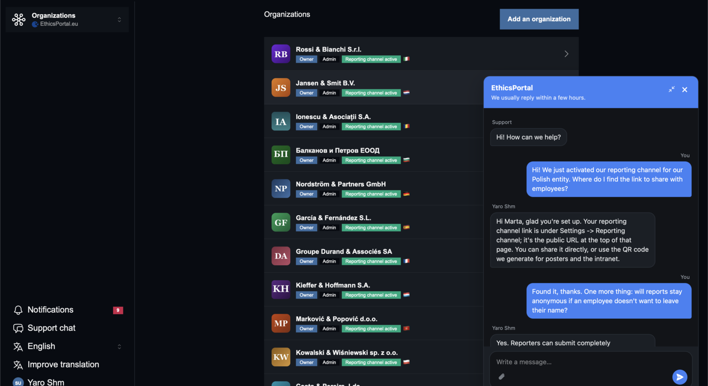

# livechat

[](https://rubygems.org/gems/livechat)
[](https://rubygems.org/gems/livechat)
[](https://github.com/yshmarov/livechat/actions/workflows/ci.yml)
[](MIT-LICENSE)

**Open-source live chat for Rails.** A chat bubble for your users, an inbox for
your team — as a gem, not another service to deploy. Alternative to Crisp,
Intercom and Chatwoot.


## Install

```ruby
# Gemfile
gem "livechat"
```

```bash
bundle install
bin/rails generate livechat:install
bin/rails db:migrate
```

```erb
<%# app/views/layouts/application.html.erb %>
<%= livechat_tag %>
```

That's it. Visit any page, click the bubble, say hi. Answer yourself at
`/livechat`.

> [!IMPORTANT]
> The inbox defaults to **development only**. Set `authorize_agent` before you
> deploy — see [Configure](#configure).

Ruby >= 3.2 · Rails >= 7.1 · Active Storage only if you want file attachments.

## What you get

|               |                                                                          |
| ------------- | ------------------------------------------------------------------------ |
| **Widget**    | Chat bubble, expandable panel, drafts preserved, unread badges            |
| **Inbox**     | Open / resolved tabs, search across everything, who-worked-what column    |
| **Team**      | Any teammate answers any thread; every reply signed with its author       |
| **Email**     | Both directions — one per unread stretch, not one per message             |
| **Files**     | Images inline, documents as links. Served through the engine, never a blob URL |
| **Realtime**  | Polling by default (no Redis, no Action Cable). Push is opt-in            |
| **Threads**   | One per visitor — a conversation, not tickets. Writing again reopens it   |
| **Deps**      | None. Plain JS — no Tailwind, no Stimulus, no importmap, no build step    |
| **Auth**      | Lambdas over the raw request — Devise, Rails 8 auth, anything             |
| **i18n**      | 26 languages, RTL included                                               |
| **Turbo/CSP** | Turbo Drive and strict nonce-based CSP out of the box                     |

## Why a gem

|                        | `livechat`                     | Hosted chat SaaS            |
| ---------------------- | ------------------------------ | --------------------------- |
| Cost                   | Free, MIT                      | Per-seat, per-month         |
| Where conversations live | Your database                | The vendor's                |
| To deploy              | `bundle add livechat`          | A script tag, or a second app |
| Visitor identity       | Server-side, from your session | Whatever the visitor types  |
| Page weight            | One `<script>`, no CDN         | Third-party bundle          |
| Infrastructure         | None. Polling by default       | Theirs, or your own Redis + Cable |
| "Powered by" badge     | Never                          | Usually, until you pay      |

## How it works

1. Add `<%= livechat_tag %>` to your layout. A bubble appears bottom-right —
   or open the panel from any element with `data-livechat-open`, or
   `window.Livechat.open()`.
2. A visitor writes. The message lands in `livechat_conversations` in your
   database, and — if you configured it — in your team's email.
3. Your team answers at `/livechat`. Several people can work the same thread;
   resolve it when done. A visitor writing again reopens it.
4. The visitor sees the reply in the widget, or by email when they're gone.

**Realtime is polling, on purpose:** ~4s while the panel is open, ~30s in the
background, nothing at all for visitors who never wrote. No Action Cable, no
Redis, no infrastructure. At support-chat volume you will not notice; your ops
person will notice there is nothing new to run. Already running Action Cable
and want instant delivery? `config.action_cable = true` — polling stays the
fallback.



## The inbox

Open and resolved tabs, unread badges, search (visitor name, email, and
everything anyone wrote), and a column showing which teammates have worked each
thread. Reply with Cmd/Ctrl+Enter, resolve, reopen. Both pages keep themselves
fresh while you watch — and never reload over a half-written reply or search.

| The list | The thread |
| --- | --- |
|  |  |

Every reply carries its author and time, and resolving is recorded in the
thread. Gated by `authorize_agent`.

## Configure

Everything is optional — a fresh install works with zero config. In
`config/initializers/livechat.rb`:

| Option | Default | What it does |
| --- | --- | --- |
| `authorize_agent` | development only | **Who can read the inbox.** Override before deploying |
| `enabled` | everyone | Who sees the widget. `false` hides it and rejects posts |
| `current_user` | `nil` | Identify the visitor. Receives the request |
| `app_name` | Rails app name | Shown in the widget header |
| `greeting` | localized default | First message visitors see |
| `reply_time_text` | localized default | "We usually reply within a few hours" |
| `launcher_label` | localized default | Text on the bubble |
| `accent_color` | `nil` | One hex restyles launcher, header, bubbles, send button |
| `show_launcher` | `true` | `false` hides the bubble — bring your own entry point |
| `visitor_label` | name, else email | How a visitor is labelled in the inbox |
| `agent_label` | name, else email | How an agent is labelled internally |
| `agent_display_name` | the full label | What **visitors** see — trim it or anonymise it |
| `mailer_from` | `nil` | Required for any email |
| `agent_emails` | `nil` | Who gets notified of new visitor messages |
| `on_visitor_message` | no-op | Runs after a visitor writes — Slack, etc. |
| `on_agent_message` | no-op | Runs after an agent replies |
| `attach_files` | `true` | File attachments (needs Active Storage) |
| `max_attachments` | `5` | Per message |
| `max_attachment_size` | `10.megabytes` | Enforced server-side |
| `allowed_attachment_types` | `nil` (any) | Or an allowlist, e.g. `%w[image/png application/pdf]` |
| `action_cable` | `false` | Opt into push delivery |
| `action_cable_url` | `"/cable"` | Match your `mount ActionCable...` |
| `rate_limit` | `{ to: 30, within: 1.minute }` | Per-IP throttle (Rails 7.2+). `nil` disables |
| `mount_path` | `"/livechat"` | Keep in sync with `mount` in `routes.rb` |

A typical initializer:

```ruby
Livechat.configure do |config|
  config.current_user     = ->(request) { request.env["warden"]&.user }
  config.authorize_agent  = ->(request) { request.env["warden"]&.user&.admin? }
  config.mailer_from      = "chat@example.com"
  config.agent_emails     = -> { User.where(admin: true).pluck(:email) }
  config.reply_time_text  = "We usually reply within an hour."
  config.accent_color     = "#7c3aed"
end
```

Gates receive the **raw request**, so they work with any auth:

```ruby
# Devise / Warden
config.current_user = ->(request) { request.env["warden"]&.user }

# Rails 8 built-in auth (bin/rails generate authentication)
config.current_user = lambda do |request|
  token = request.cookies["session_token"]
  Session.find_signed(token)&.user if token
end
```

<details>
<summary><b>Who visitors talk to</b></summary>

Replies are signed. What visitors see is up to you:

```ruby
config.agent_display_name = ->(label) { label.split.first }   # "Ada"
config.agent_display_name = ->(_label) { "Support team" }     # anonymous
```

</details>

<details>
<summary><b>Email, both directions</b></summary>

When a visitor writes and nobody has read it, the team gets one email — one per
unread stretch, not one per message. When an agent replies and the visitor is
away, the visitor gets one email (signed-in visitors automatically, guests once
they leave an address — the widget asks, gently).

Requires `mailer_from`; team notifications also need `agent_emails`. For
anything else, hook in:

```ruby
config.on_visitor_message = ->(message) { SlackNotifier.ping(message) }
```

</details>

<details>
<summary><b>File attachments</b></summary>

On by default wherever the app has Active Storage. If you don't already:

```bash
bin/rails active_storage:install && bin/rails db:migrate
```

Visitors get a paperclip in the composer; agents get a file field on the reply
form. Images render inline, other files as download links. Every file is served
through the engine's own route and gated the same way the chat is — an agent,
or the visitor who owns that conversation — so nothing leaks through a
guessable or long-lived blob URL.

Where Active Storage isn't installed, the widget quietly stays text-only.

</details>

<details>
<summary><b>Realtime with Action Cable</b></summary>

Polling is the default and needs nothing from your app. If you already run
Action Cable, turn on push so a reply appears the instant it's sent:

```ruby
config.action_cable = true
config.action_cable_url = "/cable" # match your `mount ActionCable... => ...`
```

A new message nudges the widget and the inbox to refresh at once; polling stays
the fallback, so a dropped socket or a proxy that blocks WebSockets never means
a missed message. The widget speaks the Action Cable protocol over a plain
WebSocket — no `@rails/actioncable`, no build step — and only ever subscribes
to a stream the server signed for it. Under a strict CSP, allow the socket with
`connect-src 'self'`.

</details>

## Widget API

| | |
| --- | --- |
| `window.Livechat.open()` / `.close()` | `open("Hi, I need help with…")` prefills the box — never over a visitor's draft |
| `data-livechat-open` | Any element opens the panel on click |
| `data-livechat-message="…"` | Prefill from that element — great for contextual buttons |
| `<%= livechat_button %>` | A plain, unstyled opener button |
| `config.show_launcher = false` | Hide the bubble entirely |

While replies are unread, every `data-livechat-open` element carries a small
count badge — so hiding the launcher never hides the answer.

## What it doesn't do

No AI bots, no canned responses, no omnichannel (WhatsApp, Messenger…), no
visitor tracking, no "powered by" badge. If you need a support platform,
[Chatwoot](https://github.com/chatwoot/chatwoot) is excellent. If you need your
users to be able to reach you from inside your Rails app — this is a gem's
worth of exactly that.

## Development

```bash
bundle exec rake test
bundle exec rubocop
```

## Also by the same author

- [testimonials](https://github.com/yshmarov/testimonials) — testimonials,
  reviews and NPS for Rails.
- [ideasbugs](https://github.com/yshmarov/ideasbugs) — in-app bug reports and
  feature requests.
- [i18n_proofreading](https://github.com/yshmarov/i18n_proofreading) — in-context
  translation proofreading.
- [SupeRails](https://superails.com) — Rails screencasts.

## License

MIT.
